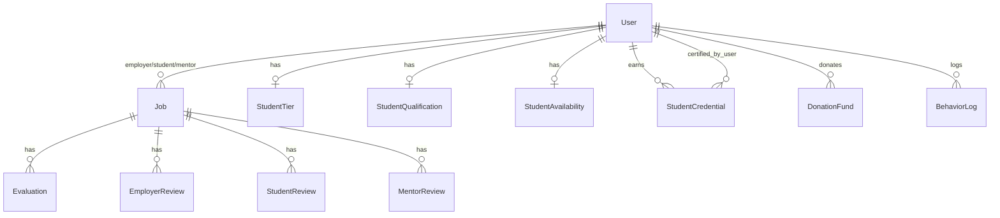

# Database Schema (สรุป)

ดูฉบับเต็มที่ [`prisma/schema.prisma`](../prisma/schema.prisma)

## กลุ่มหลัก

### Users & Roles
- `User` — ข้อมูลกลาง, มี `role` 8 ประเภท + `approval_status`
- ฟิลด์เสริมตาม role: `student_id_card`, `faculty`, `year_level`, `organization`, `staff_position`, `teacher_id_card`

### Student Profile
- `StudentTier` — trainee / apprentice / certified
- `StudentQualification` — คะแนน, badge level, max job value
- `StudentAvailability` — สถานะว่าง/ไม่ว่าง

### Credentials (5 levels)
- `StudentCredential` — บันทึกแต่ละใบรับรอง พร้อม `nft_tx_hash`
- ระดับ: `LEVEL_1` Registered → `LEVEL_5` Master Technician
- ผู้รับรอง (`CertifyingBody`): SYSTEM / PROJECT_BARAMEE / RMUTL_TEACHER / DSD / TPQI / MASTER_TECH

### Jobs
- `Job` — งานทั้งหมด, ผูก employer/student/mentor
- `Evaluation` — คะแนน 4 มิติ (quality 40 / skill 30 / time 20 / tool 10)
- `EmployerReview` / `StudentReview` / `MentorReview` — ดาว 1-5 / rubric 1-4

### Fund & Behavior
- `DonationFund` — กองทุนบริจาค
- `BehaviorLog` — เหตุการณ์ประพฤติ + severity

## Index ที่ควรรู้
- `Job` index บน `status`, `type`, `campus`, `employer_id`, `student_id`
- Reviews มี unique `(job_id, ผู้ให้, ผู้รับ)` เพื่อกัน double review

## ER Diagram (highlights)



## Migration
```bash
npx prisma migrate dev --name <ชื่อ>
npx prisma generate
```
